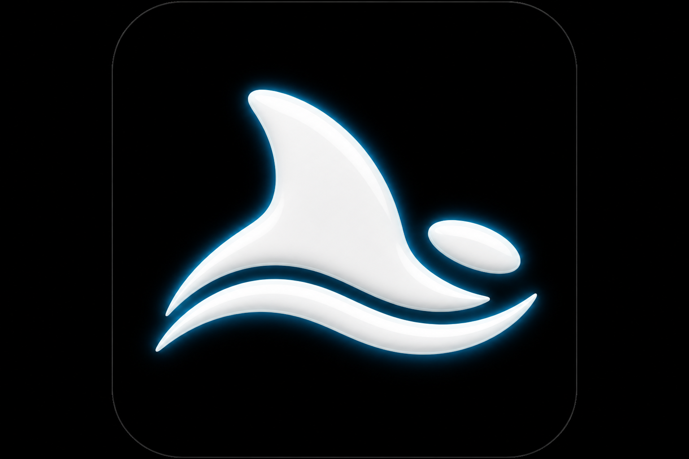
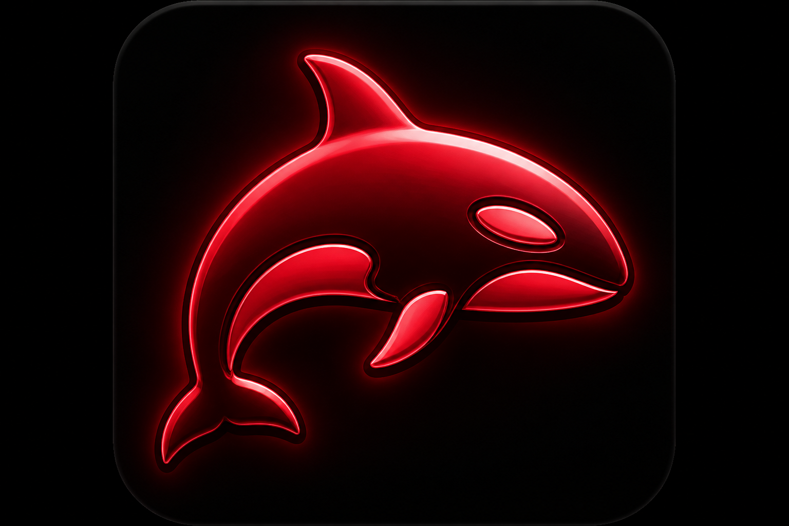
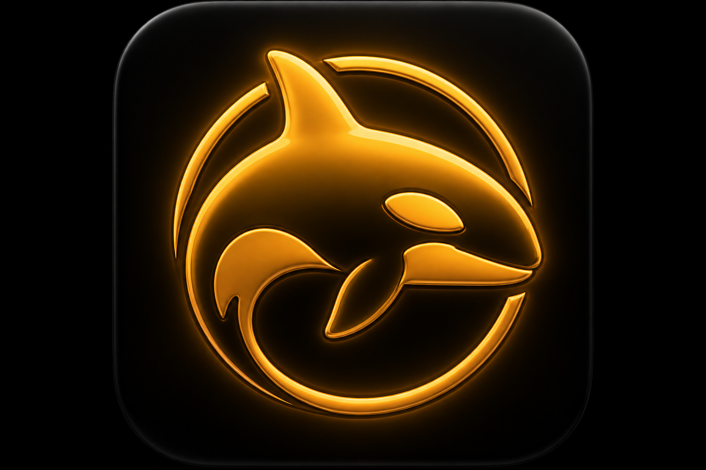
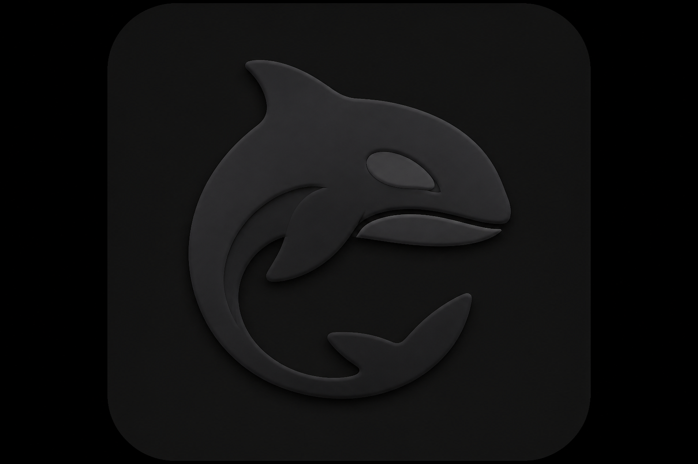

<div align="center">


# Discord Rich Presence for Orca

**Workspace, branch, and agent state on your Discord profile — every identifying field is opt-in.**

[](orca-plugin.json)
[](https://github.com/jondmarien/orca-discord-presence/releases/latest)
[](orca-plugin.json)
[](https://bun.sh)
[](tsconfig.json)
[](docs/architecture.md)
[](https://opensource.org/licenses/MIT)

`chron0.discord-presence` · publisher `chron0` · id `discord-presence` (do not rename) · Orca `>=1.4.0`

</div>

Default Discord copy is **`Working in Orca`** plus optional agent state and an elapsed timer. Repo, branch, and machine names stay off until you raise the detail level. You do **not** need your own Discord application — the plugin ships Application ID `1545653843239374848` (public snowflake; no bot token, no client secret).

Browser Discord has **no** IPC socket. Presence needs the **desktop** client (Discord, Vesktop + arRPC, or Vencord-with-RPC) on the Orca host **or** on a [companion](#dual-host-companion).

---

## What is this?

A trusted Orca plugin worker (`dist/main.js`) that publishes privacy-gated Rich Presence. Orca loads Node/Electron-compatible ESM — Bun is only for authoring and tests.

| | |
|---|---|
| Qualified id | `chron0.discord-presence` |
| What Discord shows (default) | Game `Orca` · `Working in Orca` · agent label · elapsed timer · `orca` / `state-*` art |
| What it reads | `agent.status.changed`, `workspace.readContext` (name, branch, terminal **count**, optional execution host / agent / focus), worktree events, optional `ui.focus.changed`, 90 s heartbeat |
| What it does **not** read | File paths or editor cursors. Focus titles are host-truncated and off until you opt in. |
| Discord path | Local IPC first; fork sidecar mailbox when local IPC fails; opt-in HTTP companion if Discord is on another machine ([#6](https://github.com/jondmarien/orca-discord-presence/pull/6)) |
| Settings UI | Command palette for every toggle. On [`jondmarien/orca`](https://github.com/jondmarien/orca) the sidebar can persist toggles (`settings.set`) and poll live logs (`storage.get`). Stock `stablyai/orca` rejects this 0.6.0 manifest (`ui:focus` / `sidecar`); use v0.5.0 there. |

---

## Presence look

Every non-null activity uses large image `orca` (`large_text`: `Orca`) plus one small `state-*` overlay from [`src/presence/activity.ts`](src/presence/activity.ts) (`AGENT_STATE_LABELS`). Previews are the in-repo PNGs already uploaded to the shipped Discord application. Live Discord profile screenshots can be added later — no extra states, no invented URLs.

| State | Asset key | Meaning | Preview |
|---|---|---|---|
| *(always)* | `orca` | Large image on every activity |  |
| `working` | `state-working` | Small image · `small_text` `working` |  |
| `blocked` | `state-blocked` | Small image · `small_text` `blocked` |  |
| `waiting` | `state-waiting` | Small image · `small_text` `waiting for input` |  |
| `done` / `complete` / `finished` / unrecognized | `state-idle` | Small image · `small_text` `idle` (unknown states never leak) |  |

Aliases fold into those four assets before anything is sent: `running` / `active` → working, `error` / `failed` → blocked, `needs_input` → waiting, `complete` / `finished` → done. Garbage strings still become idle — they never appear in the payload.

Files: [`assets/orca.png`](assets/orca.png) · [`assets/state-working.png`](assets/state-working.png) · [`assets/state-blocked.png`](assets/state-blocked.png) · [`assets/state-waiting.png`](assets/state-waiting.png) · [`assets/state-idle.png`](assets/state-idle.png). The small image still follows agent status when `showAgentState` is off; that toggle only hides the text label.

---

## How it works

Presence is a **privacy-gated snapshot** of your workspace and agent status. Focused-surface copy is opt-in and off by default.

1. **What drives it.** The plugin reads `agent.status.changed` (`worktreeId`, `paneKey`, `state`, `receivedAt`, optional `agent` labels), `workspace.readContext` (display name, branch, terminal **count**, optional `executionHost` / `agent` / `focusedSurface`), worktree created/removed, `ui.focus.changed` on the fork, and a 90 s heartbeat. Multiple panes/worktrees are aggregated in memory. Unknown focus kinds are dropped. File-level presence is still out of scope.
2. **Privacy default.** At `generic`, Discord only gets non-identifying copy such as `Working in Orca`, plus optional agent state and an elapsed timer. Repo, branch, and machine names stay off until you raise the detail level. [`src/presence/activity.ts`](src/presence/activity.ts) is the only module that chooses identifying strings. Discord, the HTTP bridge, and the companion transmit that result (or clear). Full gate table: [docs/privacy.md](docs/privacy.md).
3. **Where Discord must run.** Presence needs the **desktop** client (Discord, Vesktop + arRPC, or Vencord-with-RPC) — not the browser. That client must be signed in on the Orca **host/runtime**, or on a [companion](#dual-host-companion) machine if you enable the bridge. The plugin tries **local IPC first** (Unix sockets or Windows pipes, including Vesktop Flatpak nests). Handshake retries 3 times with 3 s → 15 s backoff; a missing socket fails immediately so the companion can take over. The plugin does **not** dual-publish. Wire format and debounce: [docs/architecture.md](docs/architecture.md).
4. **Stay current.** Writes are debounced to Discord’s `SET_ACTIVITY` limit (at most one per 15 s). The heartbeat and **Show Status** re-send even when the payload is unchanged. **Reload RPC** closes, reconnects, and publishes again. Stop / deactivate send `SET_ACTIVITY` null first (no ghost “Playing Orca”).

If **Show Status** reports `enabled=true connected=true detail=generic`, local IPC on the host is working. You do not need the companion unless Discord lives on a **different** machine.

## Not supported (yet)

What the plugin cannot do today, and what to do instead. Skim this with [How it works](#how-it-works).

| Limit | What to do instead | Track |
|---|---|---|
| **Focused window / tab on stock Orca** — `stablyai/orca` rejects `ui:focus` | Load v0.5.0 on stock, or smoke-test 0.6.0 against [`jondmarien/orca`](https://github.com/jondmarien/orca) `pnpm dev` | [#7](https://github.com/jondmarien/orca-discord-presence/issues/7) |
| **File-level presence** — Orca does not expose the active file | Nothing to enable; no path is sent. Focus titles are host-truncated | [#10](https://github.com/jondmarien/orca-discord-presence/issues/10) |
| **Settings panel on stock Orca** — panels cannot call `settings.set` | Use the [command palette](#commands). On the fork, sidebar toggles persist | [#10](https://github.com/jondmarien/orca-discord-presence/issues/10) |
| **Writable settings / live log tail on stock Orca** | Fork: panel `settings.*` + `storage.get` (`diagnostics.snapshot`). Stock: snapshot rewrite on a writable install + palette | [#10](https://github.com/jondmarien/orca-discord-presence/issues/10) |
| **Native Discord IPC from a paired UI client** — sidecar mailbox stores a frame; the UI executor may still be `not-implemented` | Run the [companion](#dual-host-companion) on the machine that has Discord. Sidecar + companion is not dual Discord today | companion [#6](https://github.com/jondmarien/orca-discord-presence/pull/6) · sidecar [#10](https://github.com/jondmarien/orca-discord-presence/issues/10) |
| **Browser Discord** — no IPC socket | Open Discord **desktop** (or Vesktop / Vencord-with-RPC) and stay signed in | — |
| **Two plugin installs as a bridge** — installing on two machines does not share agent events | Companion on the Discord machine; this plugin on the Orca host | [#6](https://github.com/jondmarien/orca-discord-presence/pull/6) |
| **Machine name = SSH remote host** — `os.hostname()` is the Orca **client** | Leave **Toggle Machine Name** off unless that hostname is what you want | — |
| **Presence at bare launch** | Run **Show Status**, or wait for the first agent/worktree event or 90 s heartbeat | — |
| **Instant branch updates** — branch switches emit no host event | Wait ≤90 s for the heartbeat, or run **Show Status** / **Reload RPC** | — |

Agent-table retention lives in [`src/presence/expiry.ts`](src/presence/expiry.ts) (`AGENT_RETENTION_MS`): non-done slots drop after ~30 minutes without an update; `done` slots drop after ~60 seconds. Focused-surface samples use `ACTIVITY_EXPIRY_MS.long` (60 s) so a stale “Terminal” does not stick.

---

## Features

### Core

- Privacy-first default (`detailLevel: generic`) — no workspace, branch, or machine name.
- Agent state + elapsed timer on; branch, terminals, and machine off until you opt in.
- Shipped Discord Application ID and Rich Presence assets — no developer account for end users.
- Local Discord / Vesktop / Vencord IPC on Linux, macOS, and Windows.
- Command-palette master switch, detail ladder, per-field toggles, **Clear**, and **Configure** (Application ID + optional HTTPS button).

### Advanced

- Fork Orca-1…5: writable sidebar settings, live `diagnostics.snapshot` logs, execution-host machine label, opt-in agent type/model/profile, opt-in focused surface, sidecar mailbox when local IPC fails.
- OS-agnostic companion bridge for dual-host setups ([#6](https://github.com/jondmarien/orca-discord-presence/pull/6)) — Tailscale, LAN, or SSH tunnel; token required off-loopback.
- Vesktop Flatpak + arRPC socket discovery (`$XDG_RUNTIME_DIR/.flatpak/dev.vencord.Vesktop/xdg-run/…`); reconstructs `/run/user/<uid>/` when the worker env drops `XDG_RUNTIME_DIR`.
- Handshake retry / backoff, fail-fast Application ID check, clear-before-close.
- 90 s `workspace.readContext` heartbeat (idle-reap is 5 minutes; branch switches emit no event).

### UX

- **Show Status** — force refresh + re-`SET_ACTIVITY`; toast includes `transmitting=…` (truncated last activity). Never prints the bridge token.
- **Clear** — wipe local IPC + companion activity without flipping `enabled`. Presence stays clear until the next agent event, Show Status, Reload RPC, or a settings change. The 90 s heartbeat does **not** bring it back.
- **Configure** — `invokeCommand` args for Application ID (empty = shipped default), `openUrl`, button + agent-count flags. Palette with no args shows the current public values.
- **Reload RPC** — close IPC, reconnect, publish again (slow READY, competing RPC client, Discord restart).
- **Cycle Detail Level** — `off` → `generic` → `workspace` → `full`.
- Structured `orca.log` plus a capped on-disk log under XDG state / `%LOCALAPPDATA%`.
- **Discord Presence** sidebar — live workspace (including fork execution host / agent / focus), Show Status toast, writable toggles when `settings.set` is panel-callable, live logs via `diagnostics.snapshot`. Palette commands stay for stock hosts.

---

## Installation

Orca `>=1.4.0`. Keep Discord **desktop** signed in on the Orca host, or use a [companion](#dual-host-companion) if Discord is on another machine. The browser client cannot show presence.

### 1. Turn on the plugin system

In Orca, open **Settings → Plugins** and enable **Plugin system**. Nothing runs until you install a plugin and approve its permissions.

### 2. Download the latest zip

[Latest GitHub Release](https://github.com/jondmarien/orca-discord-presence/releases/latest) — always the newest `main` build.

Direct download (filename is stable; contents change with each release):

**https://github.com/jondmarien/orca-discord-presence/releases/latest/download/chron0.discord-presence.zip**

Unzip it. You need the folder that contains `orca-plugin.json` (and `dist/main.js`). Orca does **not** install from the `.zip` file itself.

Each `main` push publishes a new release. **Testing for 0.6.0 is the `develop` branch** — `main` stays on the current release line until Jon promotes. The product version inside `orca-plugin.json` is `0.6.0`; GitHub tags look like `v0.6.0-<sha>` so every build is unique. Put `[skip release]` in a commit message to skip a release.

### 3. Load the folder in Orca

1. **Settings → Plugins** → **Install plugin**.
2. Choose the **Local folder** tab.
3. Paste the **full path** to the unzipped folder that contains `orca-plugin.json` (the path is used exactly as entered).
4. Click **Install**. Orca copies the plugin in; no plugin code runs until you review permissions.

If you added a marketplace that lists **`chron0.discord-presence`**, you can install from the marketplace **All** tab instead. That id is not on the official `stablyai/orca-plugins` index yet.

### 4. Approve consent

The plugin asks only for:

| Capability | Used for |
|---|---|
| `workspace:read` | Workspace name, branch, terminal count, optional execution host |
| `events:subscribe` | Agent status, worktree created/removed, `ui.focus.changed` |
| `storage` | Worker writes `diagnostics.snapshot`; panel polls live logs |
| `settings:own` | Persist toggles (worker + fork panel) |
| `notifications:show` | **Show Status** toast (command palette and sidebar) |
| `ui:focus` | Focused UI surface (kind + truncated title). Off unless you enable it |
| `sidecar` | Publish a presence frame so a paired UI client can apply it on the Discord machine |

No `secrets`. No terminal write. After you approve, confirm **Discord Rich Presence** (`chron0.discord-presence`) is enabled in **Settings → Plugins**.

`engines.orca` stays `>=1.4.0` (methods are probed; the fork may still report 1.4.x). Stock `stablyai/orca` will **reject this 0.6.0 manifest** because `ui:focus`, `sidecar`, and `ui.focus.changed` are not in its closed sets. v0.5.0 remains the stock-loadable line.

**Smoke-test (fork):** check out [`jondmarien/orca`](https://github.com/jondmarien/orca) `main`, `pnpm dev`, and add this plugin’s **`develop`** checkout to **Settings → Plugins → Development → Add path**. Do not expect stock `stablyai/orca` to load 0.6.0.

### 5. Confirm it is alive

Keep the Discord **desktop** client signed in. Command palette → **Discord Presence: Show Status**. You can also open the **Discord Presence** tab in Orca’s right sidebar.

Presence starts on the first agent/worktree event, command, or 90 s heartbeat — not necessarily at bare app launch.

### From source / dev

For authors and contributors (Bun 1.4+):

```bash
bun install
bun test
bun run build
```

Then load the **repository root** (the folder that contains `orca-plugin.json`) in one of these ways:

- **Settings → Plugins → Install plugin → Local folder** — same as the zip, pointed at your checkout.
- **Settings → Plugins → Development → Add path** — live `devPluginPaths` checkout (still requires consent).
- **Settings → Plugins → Install plugin → Git URL** — pin a tag or commit: `https://github.com/jondmarien/orca-discord-presence.git#<tag>`. Copy the exact tag from [the latest release](https://github.com/jondmarien/orca-discord-presence/releases/latest) (after CI: `v0.6.0-<sha>`). For fork smoke-tests, point `devPluginPaths` at a `develop` checkout.

Commit `dist/main.js` when TypeScript sources change so a checkout or marketplace clone works without a local build.

---

## Configuration

On the fork, the sidebar persists toggles via `settings.set`. The panel never writes `applicationId`, `bridgeToken`, `bridgeUrl`, `openUrl`, or `machineLabel`. Stock Orca stays palette-only. `bridgeUrl` / `bridgeToken` persist via `settings:own` or env overlays. Application ID and `openUrl` go through **Discord Presence: Configure** (`invokeCommand` args).

### Defaults

| Setting | Default | Notes |
|---|---|---|
| `enabled` | `true` | Presence on, but generic. |
| `detailLevel` | `generic` | No workspace, branch, or machine name. |
| `showBranch` / `showMachine` / `showTerminals` | `false` | Identifying (or weakly identifying). |
| `showAgentState` / `showElapsed` | `true` | Labels + Discord start timestamp only. |
| `applicationId` | `1545653843239374848` | Public; lives in [`src/presence/settings.ts`](src/presence/settings.ts) as `SHIPPED_APPLICATION_ID`. |
| `bridgeEnabled` | `false` | Companion HTTP is off until you opt in. |
| `debugLogging` | `true` | `info`/`debug` to `orca.log` + file. Connect failures always log. |
| `openUrl` / `showOpenButton` | `""` / `false` | Opt-in Discord button. HTTPS only; never put secrets in the URL. |
| `openButtonLabel` | `Open Orca` | Button label (1–32 chars). |
| `showAgentCount` | `false` | Prefix `N agent(s)` when more than one pane/worktree is live. |
| `showFocusedSurface` | `false` | Opt-in focused-surface label. Never at `generic`. |
| `focusedSurfaceDetail` | `kind` | `kind+title` only at `full`. |
| `showAgentType` / `showAgentModel` / `showAgentProfile` | `false` | Orca-3 labels; `full` only. |

Workspace, branch, and machine names — **when you enable them** — go to Discord’s servers and appear on your profile. See [docs/privacy.md](docs/privacy.md).

### Commands

| Command | Effect |
|---|---|
| Discord Presence: Enable/Disable | Master switch (`enabled`) |
| Discord Presence: Show Status | Force refresh + re-`SET_ACTIVITY`; toast `enabled=… connected=… sink=… transmitting=…` |
| Discord Presence: Reload RPC | Close + reconnect Discord IPC, then re-`SET_ACTIVITY` |
| Discord Presence: Cycle Detail Level | `off` → `generic` → `workspace` → `full` → … |
| Discord Presence: Toggle Branch | `showBranch` (needs `full`) |
| Discord Presence: Toggle Agent State | `showAgentState` |
| Discord Presence: Toggle Terminal Count | `showTerminals` |
| Discord Presence: Toggle Machine Name | `showMachine` (never at `generic`) |
| Discord Presence: Toggle Elapsed Timer | `showElapsed` |
| Discord Presence: Toggle Bridge | `bridgeEnabled` (still needs URL / token) |
| Discord Presence: Toggle Debug Logging | `debugLogging` |
| Discord Presence: Toggle Open Button | `showOpenButton` (still needs an HTTPS `openUrl`) |
| Discord Presence: Toggle Agent Count | `showAgentCount` |
| Discord Presence: Clear | `SET_ACTIVITY` null locally + companion. Does **not** disable. Held until the next agent event, Show Status, Reload RPC, or a settings write. Heartbeat does not republish. |
| Discord Presence: Configure | `invokeCommand` args: `applicationId` (empty = shipped), `openUrl`, `showOpenButton`, `openButtonLabel`, `showAgentCount`. No args = show current public values. Invalid App ID / URL fail-fast. |

### What Discord receives

| Field | Example | Gate | Default |
|---|---|---|---|
| Game name | `Orca` | Discord application name (not a plugin setting) | — |
| Details | `Working in Orca` | `detailLevel: generic` | on |
| Workspace | `acme-payments` | `detailLevel` ≥ `workspace` | off |
| Branch | `feat/refund-flow` | `full` + `showBranch` | off |
| Agent state | `working` / `blocked` / `waiting for input` / `idle` | `showAgentState` | on |
| Agent count | `2 agents · working` | `showAgentCount` | off |
| Button | `Open Orca` → your HTTPS URL | `showOpenButton` + `openUrl` | off |
| Terminals | `3 terminals` | `showTerminals` | off |
| Machine | `jon-desktop` | `showMachine` and detail ≠ `generic` | off |
| Elapsed | start timestamp | `showElapsed` | on |
| Assets | large `orca`, small `state-*` | any non-null activity | — |

| Level | Permits |
|---|---|
| `off` | Nothing — presence cleared |
| `generic` | Non-identifying “Working in Orca” + optional agent / terminals / elapsed |
| `workspace` | Workspace display name; still no branch |
| `full` | Workspace + optional branch, machine, etc. |

The Application ID is public data (it is in every presence payload). Override it with **Configure** (`applicationId`); empty restores the shipped snowflake. Invalid ids fail-fast on that command. The sidebar never shows the id. You cannot see Rich Presence buttons on your own profile — check with a second Discord account.

---

## Dual-host companion

Local Discord IPC cannot leave the machine. The **host** is wherever the Orca **runtime** runs. The **companion** is a small HTTP → Discord-IPC process you run wherever Discord / Vesktop / Vencord-with-RPC is — Linux, macOS, or Windows. Shipped in [#6](https://github.com/jondmarien/orca-discord-presence/pull/6). Short companion notes: [`companion/README.md`](companion/README.md).

**Publish policy:** prefer local IPC when the host accepts a handshake. If that fails **and** the bridge is on, POST the same privacy-gated activity. The plugin does **not** dual-publish. Switching back to local IPC clears the remote activity.

A native host-mediated remote-presence API is future work — [#10](https://github.com/jondmarien/orca-discord-presence/issues/10). Installing this plugin on two machines is not a bridge by itself.

### 1. Companion (machine with Discord)

```bash
# repository root, Bun 1.4+
bun install
bun run companion
```

Or from `companion/`: `bun run start`. Default bind: `127.0.0.1:3848` (loopback; token optional).

Off-loopback (Tailscale / LAN):

```bash
export ORCA_PRESENCE_BIND=0.0.0.0
export ORCA_PRESENCE_PORT=3848
export ORCA_PRESENCE_BRIDGE_TOKEN='<high-entropy secret>'   # openssl rand -hex 32
bun run companion
```

PowerShell: `$env:ORCA_PRESENCE_BIND = "0.0.0.0"` (same names). Optional binary: `bun run companion:compile`.

| Env | Default | Notes |
|---|---|---|
| `ORCA_PRESENCE_BIND` | `127.0.0.1` | `0.0.0.0` or the companion’s Tailscale IP for a remote host |
| `ORCA_PRESENCE_PORT` | `3848` | |
| `ORCA_PRESENCE_BRIDGE_TOKEN` | empty | **Required** when bind is not loopback |
| `ORCA_PRESENCE_CLIENT_ID` | shipped Application ID | Same public snowflake as the plugin |

The companion **refuses to start** on a non-loopback bind without a token. It reuses `src/discord/ipc.ts` / `src/discord/client.ts` (win32 pipes, POSIX sockets, Vesktop Flatpak).

### 2. Reachability

**Tailscale (recommended):** same tailnet on host and Discord machine; bind `0.0.0.0` (or the Tailscale IP) + token; allow TCP `3848` on that interface; set host `bridgeUrl` to `http://<companion-tailscale-ip>:3848`.

**SSH tunnel:** keep the companion on loopback and forward from the Orca host:

```bash
ssh -N -L 3848:127.0.0.1:3848 user@companion-host
```

Then `bridgeUrl=http://127.0.0.1:3848` (token optional because the URL is loopback).

### 3. Plugin (Orca host)

| Setting | Default | Meaning |
|---|---|---|
| `bridgeEnabled` | `false` | Palette: **Discord Presence: Toggle Bridge** |
| `bridgeUrl` | `""` | `http` / `https` only, e.g. `http://100.x.y.z:3848` |
| `bridgeToken` | `""` | Same value as `ORCA_PRESENCE_BRIDGE_TOKEN` |

Host env overlays: `ORCA_PRESENCE_BRIDGE_ENABLED`, `ORCA_PRESENCE_BRIDGE_URL`, `ORCA_PRESENCE_BRIDGE_TOKEN`.

The token is a shared secret between host and companion — **not** sent to Discord, **not** printed by Show Status or written to logs (`token=***`). Only `http:` / `https:` URLs; no credentials-in-URL. Turn the bridge off when unused.

| Method | Path | Effect |
|---|---|---|
| `POST` | `/activity` | `SET_ACTIVITY` on the companion’s Discord client |
| `DELETE` | `/activity` | Clear |
| `GET` | `/health` | `{ ok, discordConnected }` (unauthenticated; no token in the body) |

Authenticated requests send `Authorization: Bearer <token>`.

---

## Diagnostics

### Sidebar panel

v0.4 contributes one experimental panel:

| Manifest | Value |
|---|---|
| `id` | `presence` |
| Title | Discord Presence |
| Icon | Lucide `settings` |
| Entry | `panel/index.html` |
| Sidebar tab | `plugin:chron0.discord-presence/presence` |

**Open it:** enable the plugin, then open Orca’s **right sidebar** and click the Discord Presence (settings / gear) activity-bar icon.

The iframe is sandboxed. Host CSP is `default-src 'none'; connect-src 'none'; script-src 'unsafe-inline'; style-src 'unsafe-inline'; img-src data:` (plus host extras). The panel cannot `fetch`, read files, call `secrets.*`, subscribe to events, or invoke commands. On the fork it **can** call `settings.get` / `settings.set` and `storage.get`.

| Surface | How |
|---|---|
| Live workspace | `workspace.readContext` via `postMessage` `{ type: 'orca-panel-action' }` — display name, branch, terminal count, optional execution host / agent / focus |
| Show Status toast | `notifications.show` with compact `enabled` / `connected` / `sink` / `detail` from the embedded snapshot |
| Refresh | Re-reads workspace + `settings.get` + `storage.get` when those methods work |
| Field toggles | Writable on the fork via `settings.set`. Stock Orca: read-only + command palette |
| Collapsible logs | Poll `diagnostics.snapshot` (~2s) on the fork; otherwise the worker rewrite on a writable install |
| Reload RPC / Cycle Detail | Command palette. The panel **Reload RPC (palette)** button is a reminder toast, not a reconnect |

1. `panel/index.html` is a **static shell**. Marketplace / immutable installs still show live workspace + the conventional log path. Badge / About version comes from `PLUGIN_VERSION` (`#plugin-version` JSON + stamped text). A bump that forgets the panel fails `bun test`.
2. The worker writes the same redacted snapshot to `storage.set` (`diagnostics.snapshot`, ~60 KiB cap) and, on a writable install, rewrites `#presence-snapshot`.
3. Override path: `ORCA_PRESENCE_PANEL_HTML`. Skip writes: `ORCA_PRESENCE_SKIP_PANEL_WRITE=1`.
4. The Discord Application ID, bridge token, bridge URL, `openUrl`, and `machineLabel` are **never** written from the panel. Log lines are redacted (`token=***`).

### Log file

`orca.log` is easy to miss. The same structured lines go to a capped file.

| Level | When |
|---|---|
| `error` / `warn` | Always (connect, `SET_ACTIVITY`, bridge, reload) |
| `info` / `debug` | When `debugLogging` is on (default **on**) |

```
[chron0.discord-presence] info activate version=0.6.0 debug=true file=/home/you/.local/state/chron0-discord-presence/plugin.log
[chron0.discord-presence] error discord.connect_failed reason="no discord ipc socket accepted a connection"
[chron0.discord-presence] info discord.set_activity sink=local details="Working in Orca"
```

| OS | Default path |
|---|---|
| Linux / macOS | `$XDG_STATE_HOME/chron0-discord-presence/plugin.log` or `~/.local/state/chron0-discord-presence/plugin.log` |
| Windows | `%LOCALAPPDATA%\chron0-discord-presence\plugin.log` |

Override with `ORCA_PRESENCE_LOG_FILE`. Rotates to `plugin.log.1` at 256 KiB.

`connected=true` means **local** IPC on the Orca host succeeded. `sink=bridge` means the companion published instead.

---

## Building

Bun is the package manager, test runner, and build tool. **Do not** call `Bun.file` or other Bun-only APIs on the Discord IPC path — Orca loads `dist/main.js`.

```bash
bun install
bun test
bun run typecheck
bun run build
```

| Script | What it does |
|---|---|
| `bun install` | Exact lockfile versions (`bunfig.toml` `exact = true`) |
| `bun test` | `test/*.ts` (fake IPC / fake clock; no live Discord) |
| `bun run typecheck` | `tsc --noEmit` |
| `bun run build` | `src/main.ts` → `dist/main.js` (`--target node --format esm`) |
| `bun run companion` | Companion on this OS |
| `bun run companion:compile` | Optional standalone binary |

Commit `dist/main.js` when TypeScript sources change so a checkout or marketplace clone works without a local build. Zero production dependencies. File-level JSDoc only (`@module`, `@author Jonathan Marien`, `@date`).

Each push to `main` (unless the commit message contains `[skip release]`) runs `bun test` + `bun run build` and publishes `chron0.discord-presence.zip` on [GitHub Releases](https://github.com/jondmarien/orca-discord-presence/releases/latest). Tags are `v{product-version}-{sha7}`; `orca-plugin.json` / `package.json` stay at the product version (`0.6.0` on `develop` until Jon promotes). The zip includes `panel/` when that folder is present.

Module map, opcodes, and debounce: [docs/architecture.md](docs/architecture.md).

---

## Troubleshooting

| Symptom | Likely cause | What to do |
|---|---|---|
| No presence at all | Discord **browser** only | Open the Discord **desktop** app and stay signed in |
| Desktop running, still nothing | **Activity Privacy** off | Discord / Vesktop → **Settings → Activity Privacy** → **Display current activity as a status message** |
| `connected=false` | Client not ready, or IPC socket missing | Start desktop; wait ≤90 s. **Reload RPC** retries handshake (3 tries, 3 s → 15 s) |
| Handshake fails then recovers | Pipe accepted before `READY` (`data` null) | Retryable. Watch `discord.client` `connect attempt … retrying` in the log |
| Invalid Application ID toast | Persisted id is not a 17–20 digit snowflake | Falls back to the shipped id; `discord.app_id_invalid` |
| Status flickers / another game wins | Competing RPC client | **Reload RPC**, or wait for the 90 s `forceTransmit`. Discord shows one activity per application |
| “Playing Orca” after quit | Ghost activity | Stop now sends `SET_ACTIVITY` null first. **Reload RPC** or toggle Enable/Disable once |
| Presence gone after ~5 min idle | Worker idle-reap | Heartbeat should prevent this; confirm the plugin is still enabled |
| Stale branch | Branch switches emit no host event | Wait ≤90 s, or **Show Status** / **Reload RPC** |
| Lags during agent tool-use | Discord rate limit | Expected: at most one `SET_ACTIVITY` per 15 s |
| Linux cannot find the socket | `XDG_RUNTIME_DIR` stripped | Plugin reconstructs `/run/user/<uid>/` and Flatpak/Snap nests |
| Vesktop Flatpak + arRPC, no presence | Socket inside the sandbox | Enable **Rich Presence via arRPC**. Plugin also probes `.flatpak/dev.vencord.Vesktop/xdg-run/discord-ipc-*` |
| Agents on host, Discord on another OS | Local IPC cannot cross machines | [Dual-host companion](#dual-host-companion) |
| Cannot find logs | `orca.log` is easy to miss | Open the **Discord Presence** sidebar (Extension Logs) or **Show Status**; then `~/.local/state/chron0-discord-presence/plugin.log` or `%LOCALAPPDATA%\…`. Marketplace copies may show an empty log view until the worker can rewrite the panel |
| Panel toggles do nothing | Stock Orca, or `settings.set` probe failed | Expected on stock. Use the command palette. Fork: `jondmarien/orca` `pnpm dev` |
| Wrong / missing art | Assets not propagated, or wrong Application ID | Confirm keys `orca`, `state-working`, `state-blocked`, `state-waiting`, `state-idle` |
| `activate` killed at startup | Handshake blocked the ready timeout | First refresh is fire-and-forget |

**Show Status** never prints the bridge token. **Reload RPC** is the “Discord restarted / Vesktop was slow / another client stole the activity” command.

Limits and workarounds (focus, settings panel, companion, browser Discord, stale branch): [Not supported (yet)](#not-supported-yet).

---

## Docs

| Doc | What |
|---|---|
| [What is this?](#what-is-this) | Identity, default Discord copy, inputs |
| [Presence look](#presence-look) | Activity states + in-repo `assets/` previews |
| [How it works](#how-it-works) | What drives presence, where Discord must run, privacy default |
| [Not supported (yet)](#not-supported-yet) | Limits + what to do instead |
| [Features](#features) | Core / advanced / UX |
| [Installation](#installation) | Zip → Settings → Plugins → Local folder → consent → Show Status |
| [Configuration](#configuration) | Defaults, commands, disclosure |
| [Dual-host companion](#dual-host-companion) | Bridge, Tailscale, SSH |
| [Diagnostics](#diagnostics) | Sidebar panel + `orca.log` / file path |
| [Building](#building) | Bun scripts |
| [Troubleshooting](#troubleshooting) | Desktop, Vesktop, dual-host |
| [docs/architecture.md](docs/architecture.md) | Process model, IPC opcodes, debounce, Reload RPC |
| [docs/privacy.md](docs/privacy.md) | Gate table and never-transmitted list |
| [companion/README.md](companion/README.md) | Companion start / HTTP surface |
| [ROADMAP.md](ROADMAP.md) | Limits and follow-up work |
| [#6](https://github.com/jondmarien/orca-discord-presence/pull/6) | Companion MVP (merged) |
| [#7](https://github.com/jondmarien/orca-discord-presence/issues/7) | Focused window / tab (consumed on the fork as of 0.6.0) |
| [#10](https://github.com/jondmarien/orca-discord-presence/issues/10) | Fork Orca-1…5 consumed in 0.6.0; stock Orca still closed |
| [#15](https://github.com/jondmarien/orca-discord-presence/issues/15) | Clear, presence button, configure, multi-agent (v0.5) |
| [PR #11](https://github.com/jondmarien/orca-discord-presence/pull/11) | Diagnostics panel (v0.4) |
| [Issues](https://github.com/jondmarien/orca-discord-presence/issues) | Tracker |

---

## License

MIT

---

<div align="center">

`chron0.discord-presence` · Jonathan Marien · [Architecture](docs/architecture.md) · [Privacy](docs/privacy.md) · [Roadmap](ROADMAP.md) · [Issues](https://github.com/jondmarien/orca-discord-presence/issues)

</div>
